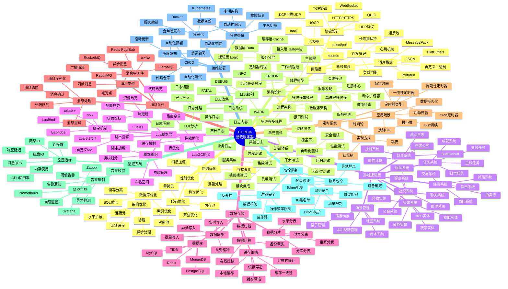

# C++/Lua 游戏服务器架构思维导图



---

## 详细说明

### 1. 网络层

#### IO模型选择
- **epoll**: Linux高并发首选，支持百万级连接
- **kqueue**: FreeBSD/macOS平台
- **IOCP**: Windows平台高性能IO
- **io_uring**: Linux新一代异步IO接口

#### 协议设计要点
- 消息头设计：长度+命令号+序列号
- 心跳机制：保活与超时检测
- 分包粘包处理：固定长度/分隔符/长度前缀

### 2. 架构设计模式

#### 常见架构
```
[客户端] → [Gateway] → [Logic Server] → [DB/Cache]
              ↓
         [Game Server 1] [Game Server 2] ...
```

#### 服务拆分原则
- 按功能拆分：登录服、场景服、战斗服、社交服
- 按玩家拆分：分区分服、全区全服

### 3. Lua脚本层

#### C++与Lua交互
```cpp
// 导出C++类到Lua
sol::state lua;
lua.new_usertype<Player>("Player",
    "getName", &Player::getName,
    "setLevel", &Player::setLevel
);
```

#### 热更新实现
1. 保存玩家状态
2. 重新加载Lua脚本
3. 恢复玩家状态
4. 通知客户端刷新

### 4. 数据存储策略

#### 缓存层级
```
L1: 本地内存缓存 (玩家在线数据)
L2: Redis分布式缓存 (共享数据)
L3: 数据库持久化 (最终存储)
```

#### 写入策略
- Write Through: 同步写缓存和DB
- Write Back: 先写缓存，异步刷盘
- Write Around: 直接写DB，缓存失效

### 5. 性能优化关键点

#### 内存优化
- 使用内存池避免频繁malloc/free
- 对象池复用游戏对象
- Lua GC调优

#### 网络优化
- 消息合并发送
- 协议压缩
- 增量更新

### 6. 安全防护体系

#### 服务端校验
- 所有客户端输入必须校验
- 关键操作服务端权威计算
- 状态同步防加速/瞬移

#### 反外挂
- 行为分析检测异常
- 客户端完整性校验
- 加密通信防抓包

---

## 技术选型参考

| 组件 | 推荐方案 | 备选方案 |
|------|----------|----------|
| 网络库 | libev/libuv | boost.asio, muduo |
| 数据库 | MySQL + Redis | PostgreSQL, MongoDB |
| 消息队列 | Kafka | RabbitMQ, RocketMQ |
| 脚本引擎 | LuaJIT | Lua 5.4 |
| 监控 | Prometheus + Grafana | Zabbix |
| 容器 | Kubernetes | Docker Swarm |

---

## 开发流程建议

1. **需求分析** → 确定游戏类型和核心玩法
2. **架构设计** → 确定技术方案和模块划分
3. **基础框架** → 搭建网络、数据库、日志等基础设施
4. **核心系统** → 实现登录、场景、战斗等核心功能
5. **功能扩展** → 逐步添加社交、经济等系统
6. **性能优化** → 压测并优化瓶颈
7. **安全加固** → 完善安全防护体系
8. **上线运维** → 部署、监控、持续迭代
